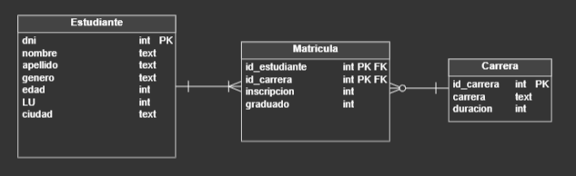
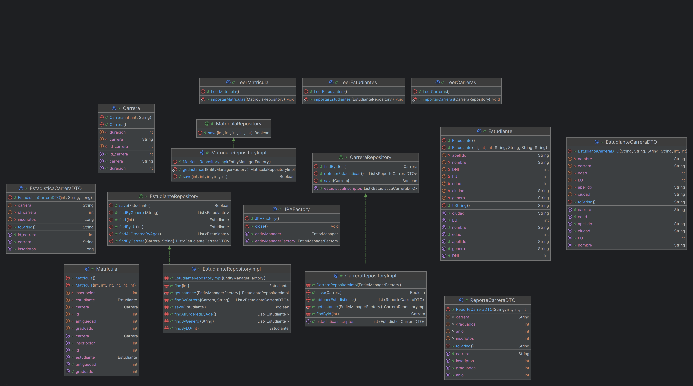

# Trabajo Integrador N°2

---

Este sistema esta centrado principalmente en los estudiantes como la entidad principal a las que queremos dar de alta, anotar a carreras, obtener datos de egresos de ingresos.

### 🏗️ **Patrones de diseño**

---

* Repository
* DTO
* Factory
* Singleton

# Diagrama Entidad Relación

---

# Diagrama de Clases

---

